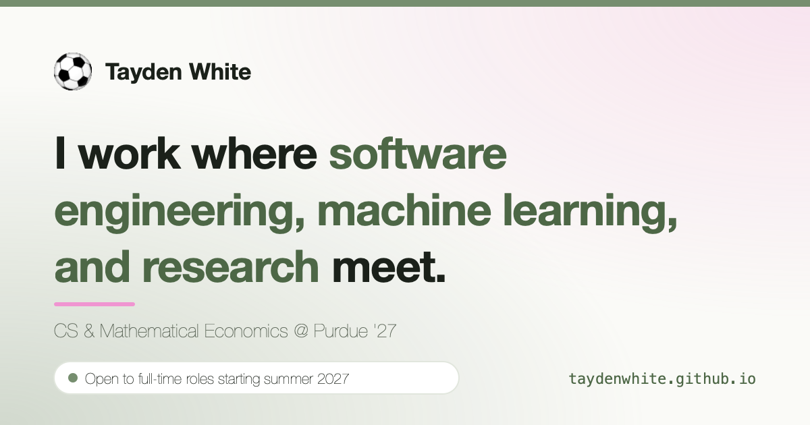

# taydenwhite.github.io

Source for [taydenwhite.github.io](https://taydenwhite.github.io), the personal site of Tayden White: Computer Science & Mathematical Economics at Purdue University, Class of 2027.



## Stack

- **[Hugo](https://gohugo.io/) 0.150.0 (extended)** with a custom theme written for this site. There are no theme dependencies, no Node.js, and no CSS framework.
- **Plain CSS** with custom properties for light and dark mode, bundled and fingerprinted by Hugo Pipes.
- **Vanilla JavaScript**, bundled with Hugo's built-in esbuild: theme toggle, mobile nav, project filters, click-to-load YouTube embeds, and a playable Pong game.
- **GitHub Actions** builds the site, fails the build on broken internal links ([htmltest](https://github.com/wjdp/htmltest)), and deploys to **GitHub Pages**.

## Run it locally

Install [Hugo extended](https://gohugo.io/installation/) 0.146 or newer, then:

```bash
hugo server
```

Open http://localhost:1313. To produce and check a production build:

```bash
hugo --gc --minify
go install github.com/wjdp/htmltest@v0.17.0 && htmltest
```

## Project layout

```
content/          Pages in Markdown (projects/, research/, about/, experience/, resume/, playground/, lists/)
data/             Resume facts: profile.yaml, experience.yaml, skills.yaml (single source of truth)
layouts/          Templates: home, section, page, 404, plus about/, experience/, resume/
  _partials/      Head/SEO, header, footer, cards, timeline items, case-study layout, icons
  _shortcodes/    embed-pdf, embed-video, youtube, flow, callout, pong, searchable-table
assets/           css/main.css, css/syntax.css, js/main.js, js/pong.js, images/, icons/
static/           resume.pdf, favicons, share image
docs/             Notes and source files that aren't part of the site build
```

### Writing a project or research page

Create `content/projects/<slug>/index.md` (or under `research/`). Any page with a `summary` renders as a case study with a details sidebar:

```yaml
---
title: Project name
summary: One or two sentences on what it is and the result.
org: Organization            # or `kicker:` for a custom label
role: Your role
dates: Jan 2026 – May 2026
weight: 10                   # order on the list page
featured: 1                  # optional: show on the home page, in this order
stack: [Python, PostgreSQL]
tags: [Machine Learning]     # powers the topic filters on /projects/
metrics:
  - value: "10×"
    label: faster queries
links:
  - label: Source on GitHub
    url: https://github.com/…
cover: cover.png             # optional image in the same folder
coverAlt: Description of the image
---
```

### Updating the resume

1. Replace `static/resume.pdf`.
2. Update the matching facts in `data/profile.yaml`, `data/experience.yaml`, and `data/skills.yaml`, including `resumeUpdated`.

## License

Code is MIT licensed. Content (writing, images, PDFs, and resume) is all rights reserved. See [LICENSE](LICENSE).
